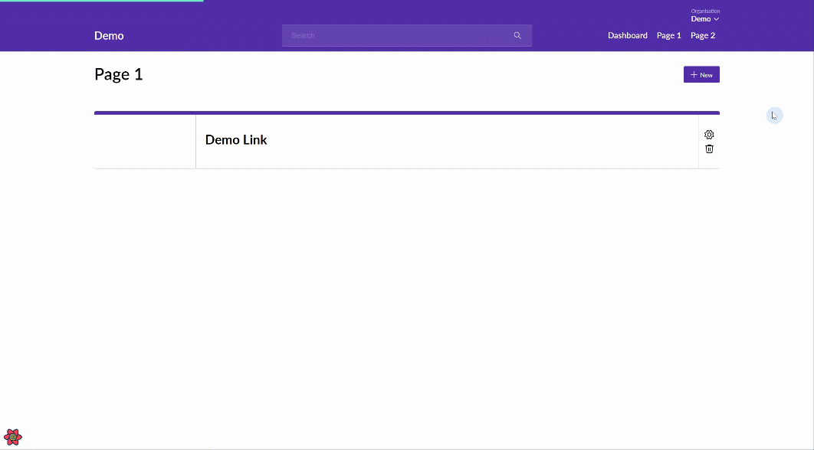

# react-panel-manager-context

Is a lightweight typesafe promised based react context for the management of nested panels.  As panels are opened they are replaced in-place, a history is maintained for panel traversal.
You can await the result of any opened panel allowing for values to be conveniently resolved in a child parent relationship. The original use case for the context was an administration portal.



## Basic Usage

1. Setup the context provider: 

    You can optionally configure the panels location, default is a right slide out.
    ```ts
    <PanelManagerContextProvider>
      <ExampleChild />
    </PanelManagerContextProvider>
    ```
2. Setup a panel:

    A panel can be any type of react component that implements *ManagedPanel* as props. Close and dismiss functions are passed in as props and are required to be implemented, close() will clear the current panel, while dismiss() will clear all opened panels.
    ```ts
    const CustomPanel: FunctionComponent<ManagedPanel> = ({ close, dismiss }) => {
      const controls = [
        <Button onClick={() => close()}>Save</Button>
      ];
      return (
        <Panel
          actions={controls}
          title="Panel"
          onDismiss={() => dismiss()}
        >
          Content
        </Panel>
      );
    }
    ```
3. Register and open the panel:

    You can register as many panels as need, each panel requires a unique key, register() returns the function to open that panel.
    ```ts
    const ExamplePage: FunctionComponent = () => {
      const { register } = usePanelManagerContext();
      const open = register(({ dismiss, close}) => 
        <CustomPanel key="panel" close={close} dismiss={dismiss} />
      )
      return (<Button onClick={() => open()}>Open Panel</Button>);
    }
    ```

## Advanced Usage

### Resolving an async panel

Each open function returns a typed promise to await, a panel can resolve that promise by calling close with or without a value.

```ts
const CustomPanel: FunctionComponent<ManagedPanel<string>> = ({ close, dismiss }) => {
  const stringValue = "Hello world";
  const controls = [
    <Button onClick={() => close(stringValue)}>Save</Button>
  ];
  return (
    <Panel
      actions={controls}
      title="Panel"
      onDismiss={() => dismiss()}
    >
      Content
    </Panel>
  );
}
```
```ts
const ExamplePage: FunctionComponent = () => {
const { register } = usePanelManagerContext();
const open = register<string>(({ dismiss, close}) => 
  <CustomPanel key="panel" close={close} dismiss={dismiss} />
)
return (
<Button onClick={() => {
    const stringValue = await open();
    console.log(stringValue);
}}>
  Open Panel
</Button>
);
}
 ```

### Passing in custom props

You can pass any typed value into the open function which can then be mapped onto the panel as props.

```ts
const CustomPanel: FunctionComponent<ManagedPanel<void, string>> = ({ close, dismiss, props }) => {
  const controls = [
    <Button onClick={() => close()}>Save</Button>
  ];
  return (
    <Panel
      actions={controls}
      title="Panel"
      onDismiss={() => dismiss()}
    >
      Content
    </Panel>
  );
}
```
```ts
const ExamplePage: FunctionComponent = () => {
const customProps = "Hello world";
const { register } = usePanelManagerContext();
const open = register<string>(({ dismiss, close, props }) => 
  <CustomPanel key="panel" close={close} dismiss={dismiss} props={props} />
)
return (<Button onClick={() => open(customProps)}>Open Panel</Button>);
}
 ```

### Nested panels

You can register sub panels within panels in nested child parent relationship.

```ts
const SubPanel: FunctionComponent<ManagedPanel> = ({ close, dismiss }) => {
  const controls = [
    <Button onClick={() => close()}>Save</Button>
  ];
  return (
    <Panel
      actions={controls}
      title="Panel"
      onDismiss={() => dismiss()}
    >
      A sub panel.
    </Panel>
  );
}
```
```ts
const CustomPanel: FunctionComponent<ManagedPanel> = ({ close, dismiss }) => {
    const { register } = usePanelManagerContext();
    const open = register<(({ dismiss, close}) => 
      <SubPanel key="sub-panel" close={close} dismiss={dismiss} />
    )
  const controls = [
    <Button onClick={() => close()}>Save</Button>
  ];
  return (
    <Panel
      actions={controls}
      title="Panel"
      onDismiss={() => dismiss()}
    >
      <Button onClick={() => open()}>Open Sub Panel</Button>
    </Panel>
  );
}
```
```ts
const ExamplePage: FunctionComponent = () => {
const { register } = usePanelManagerContext();
const open = register(({ dismiss, close}) => 
  <CustomPanel key="panel" close={close} dismiss={dismiss} />
)
return (<Button onClick={() => open()}>Open Panel</Button>);
}
```

## API

```ts
type OpenPanelFunction<ResultType, PropType = undefined> = PropType extends undefined
  ? () => Promise<ResultType | null>
  : (props: PropType) => Promise<ResultType | null>;

type ClosePanelFunction<PropType = undefined> = PropType extends undefined
  ? () => void
  : (props?: PropType) => void;

type RegisterPanelFunction<ResultType = void, PropType = undefined> = (
  props: ManagedPanel<ResultType, PropType>
) => ReactElement<ManagedPanel<ResultType, PropType>>;

interface PanelManagerContext {
  register: <ResultType = void, PropType = undefined>(
    registerPanelFunction: RegisterPanelFunction<ResultType, PropType>
  ) => OpenPanelFunction<ResultType, PropType>;
  dismiss: () => void;
}
type ManagedPanel<ResultType = void, PropType = undefined> = PropType extends undefined
  ? {
    dismiss: () => void;
    close: ClosePanelFunction<ResultType>;
  }
  : {
    dismiss: () => void;
    close: ClosePanelFunction<ResultType>;
    props: PropType;
  };

enum PanelManagerPosition {
  Left,
  Right
}

interface PanelManagerContextProps {
  position?: PanelManagerPosition;
}
```
